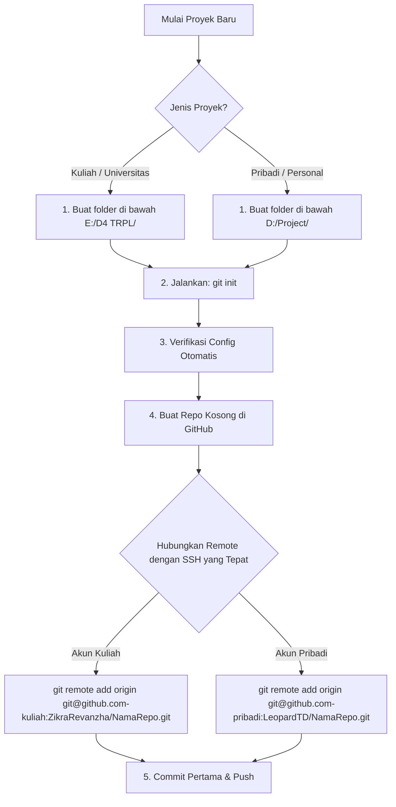

# Panduan Alur Pembuatan Proyek Baru (Kuliah vs Pribadi)

Dokumen ini menjelaskan langkah-langkah awal yang **wajib dilakukan pertama kali** saat membuat proyek baru di komputer Anda, agar Git secara otomatis menggunakan akun dan email yang tepat tanpa terjadi konflik.

---

## Alur Kerja Utama (Workflow)



---

## Langkah-Langkah Detil

### Langkah 1: Tentukan Folder Proyek (Sangat Penting!)
Berkat fitur `includeIf` pada Git Config global Anda, Git akan mendeteksi identitas Anda berdasarkan folder tempat proyek berada.

* **Untuk Proyek Kuliah:**
  Buat folder proyek Anda di dalam direktori kuliah Anda:
  `E:\D4 TRPL\nama-proyek-kuliah`
* **Untuk Proyek Pribadi:**
  Buat folder proyek Anda di dalam direktori pribadi Anda:
  `D:\Project\nama-proyek-pribadi`

---

### Langkah 2: Inisialisasi Git Lokal
Buka terminal (PowerShell/CMD) di dalam folder proyek baru tersebut, lalu jalankan:
```powershell
git init
```

---

### Langkah 3: Verifikasi Identitas Git
Sebelum membuat commit apa pun, pastikan Git telah memuat profil yang benar secara otomatis berdasarkan foldernya. Jalankan:
```powershell
git config user.name
git config user.email
```
* **Hasil yang seharusnya muncul:**
  * Di dalam folder `E:\D4 TRPL\`: `ZikraRevanzha` / `zikrarevanzha@gmail.com`
  * Di dalam folder `D:\Project\`: `LeopardTD` / `email_pribadi_anda@example.com`

---

### Langkah 4: Buat Repositori di GitHub
1. Masuk ke GitHub dengan akun yang sesuai (Kuliah atau Pribadi).
2. Buat repositori baru yang kosong (jangan centang opsi *Add a README* atau *Add .gitignore* agar repositori benar-benar kosong).

---

### Langkah 5: Hubungkan Remote Menggunakan SSH Host Khusus
Ini adalah kunci agar proses push menggunakan SSH Key yang benar. Salin URL SSH dari GitHub, lalu sesuaikan host-nya:

* **Untuk Proyek Kuliah (Menggunakan Host `github.com-kuliah`):**
  ```powershell
  git remote add origin git@github.com-kuliah:ZikraRevanzha/nama-proyek-kuliah.git
  ```
* **Untuk Proyek Pribadi (Menggunakan Host `github.com-pribadi`):**
  ```powershell
  git remote add origin git@github.com-pribadi:LeopardTD/nama-proyek-pribadi.git
  ```

---

### Langkah 6: Lakukan Commit Pertama & Push ke GitHub
Buat file awal (misalnya `.gitignore` atau `README.md`), kemudian jalankan:
```powershell
# Tambahkan file ke staging
git add .

# Lakukan commit pertama
git commit -m "chore: commit pertama inisialisasi proyek"

# Ubah nama branch utama menjadi main
git branch -M main

# Dorong (push) ke GitHub
git push -u origin main
```

Dengan mengikuti alur ini, Anda dijamin tidak akan pernah mengalami error bentrok izin (403 Permission Denied) di masa mendatang!
